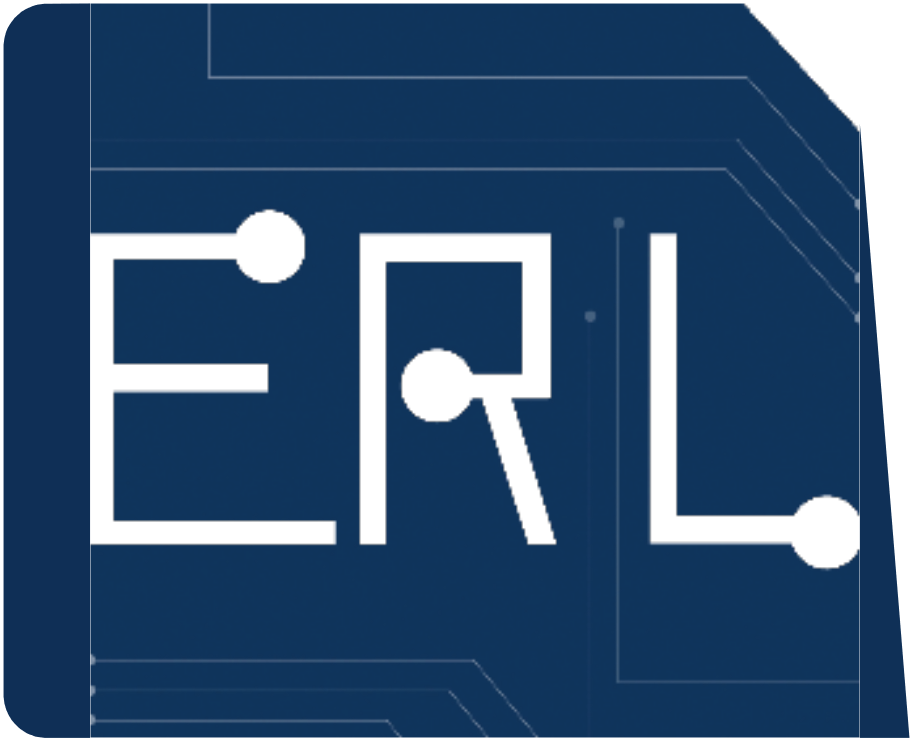
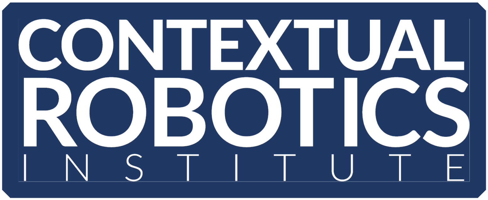

<div align="center">
  <a href="http://erl.ucsd.edu/">
    
  </a>
  <a href="https://contextualrobotics.ucsd.edu/">
    
  </a>
  <a href="https://ucsd.edu/">
    
  </a>
</div>

# ROAM: Riemannian Optimization for Active Mapping with Robot Teams

ROAM is a library for distributed multi-robot autonomous exploration using a stream of depth and semantic segmentation images as the input to build a semantically annotated OctoMap in real-time without any central mapping or planning node.

ROAM is implemented as two ROS packages, can be built on x86-64 and ARM-based processors:
- Distributed multi-robot semantic octree mapping of an environment ([ROAM-Mapping](https://github.com/ExistentialRobotics/ROAM/tree/master/ROAM-Mapping))
- Distributed multi-robot collaborative safety and perception-aware exploration ([ROAM-Planning](https://github.com/ExistentialRobotics/ROAM/tree/master/ROAM-Planning))

<iframe width="560" height="315" src="https://www.youtube.com/embed/EADUWRSkOKs?si=AWzxCNrm_wy1hcU0" title="ROAM" frameborder="0" allow="accelerometer; autoplay; clipboard-write; encrypted-media; gyroscope; picture-in-picture; web-share" referrerpolicy="strict-origin-when-cross-origin" allowfullscreen></iframe>

## Citation

If you found this work useful, we would appreciate if you could cite our work:

- [1] A. Asgharivaskasi, F. Girke, N. Atanasov. [**Riemannian Optimization for Active Mapping with Robot Teams**](https://arxiv.org/abs/xxx). [arXiv:xxx
](https://arxiv.org/abs/xxx).
 
 ```bibtex
@InProceedings{Asgharivaskasi-TRO24,
  title = {Riemannian Optimization for Active Mapping with Robot Teams},
  author = {Asgharivaskasi, Arash and Girke, Fritz and Atanasov, Nikolay},
  year = {2024},
  booktitle = {arxiv},
  pdf = {https://arxiv.org/pdf/xxx.pdf}
}
```

- [2] A. Asgharivaskasi, S. Koga, N. Atanasov. [**Active Mapping via Gradient Ascent Optimization of Shannon Mutual Information over Continuous SE(3) Trajectories**](https://ieeexplore.ieee.org/abstract/document/9981875/). IEEE/RSJ International Conference on Intelligent Robots and Systems (IROS), 2022.

```bibtex
@InProceedings{Asgharivaskasi-IROS22,
  author={Asgharivaskasi, Arash and Koga, Shumon and Atanasov, Nikolay},
  booktitle={IEEE/RSJ International Conference on Intelligent Robots and Systems (IROS)}, 
  title={Active Mapping via Gradient Ascent Optimization of {S}hannon Mutual Information over Continuous {SE(3)} Trajectories}, 
  year={2022},
  pages={12994--13001}
```

## Acknowledgments

We gratefully acknowledge support from [NSF](https://www.nsf.gov/) FRR CAREER 2045945 and ARL [DCIST](https://www.dcist.org/) CRA W911NF-17-2-0181.

## License

[BSD License](LICENSE.BSD)
